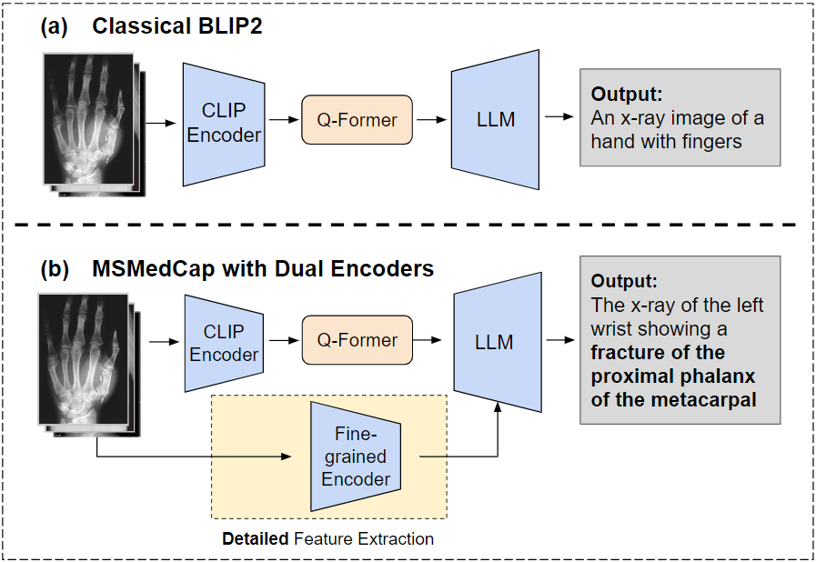
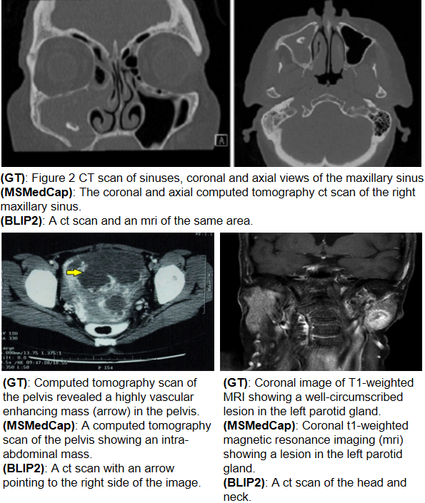

# MSMedCap   

This repo contains source code for our [MSMedCap paper. ](https://ieeexplore.ieee.org/document/10446878)


## 1.Introduction  

Current generic text and image pretrained models do not yield satisfactory results when it comes to describing intricate details within medical images. So, Based on classical multimodality model [BLIP 2](https://github.com/salesforce/LAVIS), we present a novel medical image captioning method guided by the [segment anything model (SAM)](https://github.com/facebookresearch/segment-anything) to enable enhanced encoding with both general and detailed feature extraction. The architecture of our model is shown below.    



Compared to the classical model [BLIP 2](https://github.com/salesforce/LAVIS), the MSMedCap shows significant improvement on medical datasets. 



## 2.Setup Instructions

Please create a virtual environment with Python 3.8 and activate it.

```bash
conda create -n msmedcap python=3.8
conda activate msmedcap
```

and type the following instruction. 

```bash
git clone https://github.com/AHandsomePython/MSMedCap.git 
cd MSMedCap
pip install -r requirements.txt
```


## 3.Run the code

Our code is revised based on [lavis](https://github.com/salesforce/LAVIS). We use the opt model with 2.7 billion parameters in [lavis](https://github.com/salesforce/LAVIS). So, only files about opt model and Q-Former are revised and other files stay the same as [lavis](https://github.com/salesforce/LAVIS). 
### 3.1 Training
### Training Stage 1
The config file can be edited at 
```bash
MSMedCap/lavis/projects/blip2/train/pretrain_stage1.yaml
```
If you want to load pretrain pth file, go to:

```bash
/MSMedCap/lavis/configs/models/blip2/blip2_pretrain.yaml
```

The input data should be some images and some json annotations, replace them in:

```bash
/MSMedCap/lavis/configs/datasets/coco/defaults_cap.yaml
```

To run the training stage 1, type the instruction: 
```bash
python -m torch.distributed.run --nproc_per_node=2 train.py --cfg-path lavis/projects/blip2/train/pretrain_stage1.yaml
```
Please note that you should train Q-Former of SAM and BLIP 2 individually and run the jupyter file transform.ipynb to merge the weights. 

### Training Stage 2

The config file can be edited at 
```bash
MSMedCap/lavis/projects/blip2/train/pretrain_stage2.yaml
```
To run the training stage 2, type the instruction: 
```bash
python -m torch.distributed.run --nproc_per_node=2 train.py --cfg-path lavis/projects/blip2/train/pretrain_stage2.yaml
```


## 5.Available checkpoints
Link to pre-trained weights can be downloaded from [Google Drive](https://drive.google.com/drive/folders/1iYher5k2D-QduA5BQBzVpeasfRHjLYek?usp=drive_link)


## 6.Test
Run the jupyter file generate.ipynb to test your output. The config file can be edited at 
```bash
MSMedCap/lavis/configs/models/blip2/blip2_caption_opt2.7b.yaml
```
You can also use instruction to evaluate the output. 
```bash
python -m torch.distributed.run --nproc_per_node=2 evaluate.py --cfg-path lavis/projects/blip2/eval/caption_coco_opt2.7b_eval.yaml
```
## 7.Ackonwledgements

We are grateful to [LAVIS](https://github.com/salesforce/LAVIS) and [SAM](https://github.com/facebookresearch/segment-anything), on which our codes are developed.

## 8.Citation

If you find our paper and/or code helpful, please consider citing:
```bash
@inproceedings{zhang2024sam,
  title={Sam-Guided Enhanced Fine-Grained Encoding with Mixed Semantic Learning for Medical Image Captioning},
  author={Zhang, Zhenyu and Wang, Benlu and Liang, Weijie and Li, Yizhi and Guo, Xuechen and Wang, Guanhong and Li, Shiyan and Wang, Gaoang},
  booktitle={ICASSP 2024-2024 IEEE International Conference on Acoustics, Speech and Signal Processing (ICASSP)},
  pages={1731--1735},
  year={2024},
  organization={IEEE}
}
```